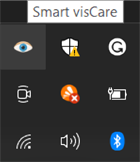

    
# Smart visCare

This app reminds you to take your eyes off the screen but only when you are working on your PC so you can just let it run in the background.

## Features

- Three customizable variables : Break interval, Break duration, Idle time threshold

- Works in background

- Notifications to remind you to take your eyes off the screen

- Notifications to let you know when to come back

- Track Your time